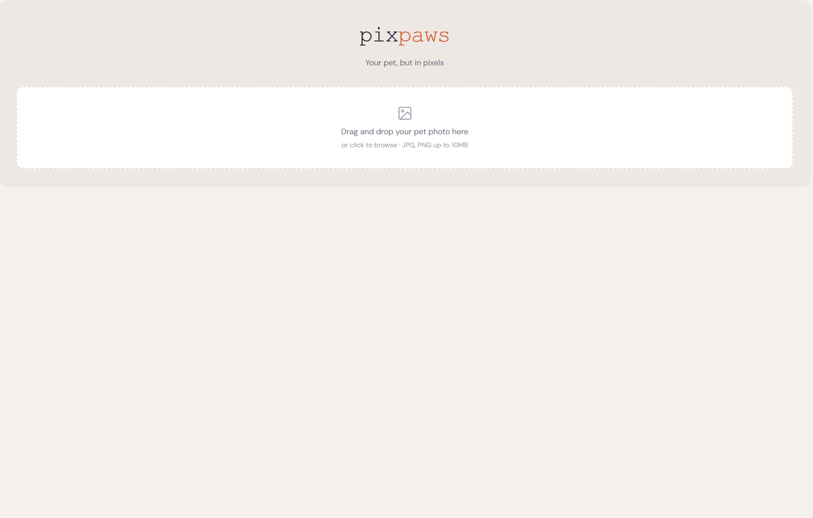
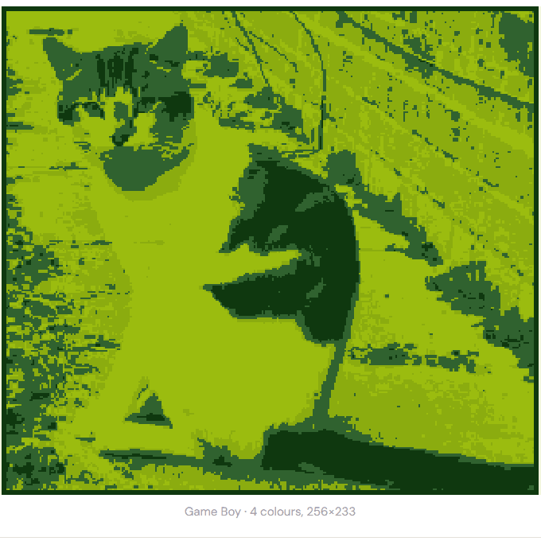
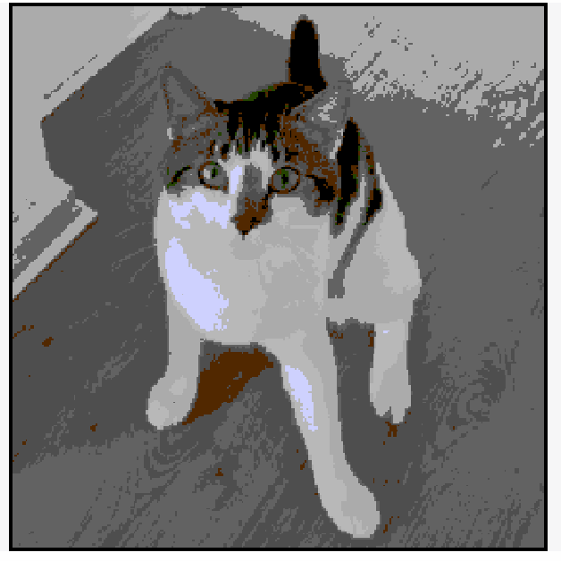

# 🐾 pixpaws

**Your pet, but in pixels.**

A free, client-side web app that transforms your pet photos into retro pixel art using classic gaming palettes.


(this handsome lad is Sebastian, my latest rescue!)

---

## The story

This is a *pet* project (pun intended).

I built pixpaws during my holidays for fun due to my 2 favourite things **pets** and **video games**. 

Although the idea is simple, in practice, the image processing was quite fun to figure out. Finding out how to map millions of colours to a 4 or 15 pallete was interesting.

My first approach was to pick the closest colour using basic maths, and that ended up producing wrong results 🤡

You need a formula that accounts for how human eyes actually perceive colour (because we're way more sensitive to green than blue, the distance calculation has to compensate). Some with Dithering. Floyd-Steinberg looks simple until you realise the browser's Uint8ClampedArray quietly kills your error propagation precision and you get ugly banding instead of smooth gradients 🤡.

---

## Features

### 🎨 Style presets

10 retro and modern palettes:

- **Game Boy** - The classic 4-colour DMG green
- **NES** - Full 54-colour PPU palette
- **SNES** - 16-colour curated palette
- **CGA** - 4-colour cyan/magenta nostalgia
- **Commodore 64** - The C64's iconic 16 colours
- **ZX Spectrum** - 15-colour British micro energy
- **Pico-8** - The beloved fantasy console palette
- **Modern indie** - Stardew Valley vibes
- **Pastel** - Soft tones 
- **Monochrome** - B&W

### 🖼️ Frame overlays



- **Game Boy**
- **Polaroid**
- **Arcade** 
- **Film strip** 
- **None** 

### 🔲 Dithering modes



- **Floyd-Steinberg** - Smooth error diffusion
- **Ordered (Bayer)** - Crosshatch pattern
- **Atkinson** - High contrast, classic Mac OS feel
- **None** - Flat colour mapping

---

## Stack

- **React** + **Vite** + **Tailwind CSS**
- **HTML Canvas API** for all image processing
- Colour quantisation with weighted RGB distance for perceptual accuracy
- No dependencies on external APIs

---

## Run locally

```bash
git clone https://github.com/shiphrahx/pixpaws.git
cd pixpaws
npm install
npm run dev
```

---

## Build & deploy

```bash
npm run build
```
